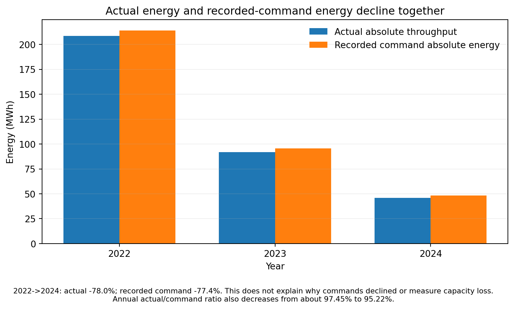
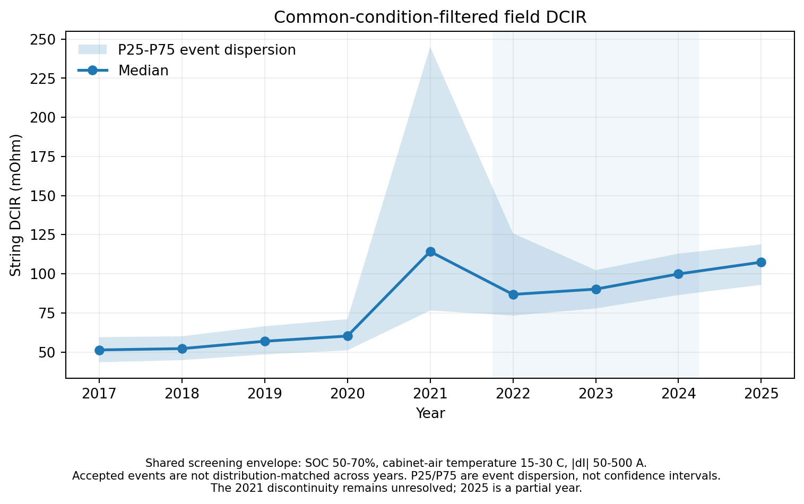

# Case-003 - Can the BMS Data Be Trusted?

**Separating telemetry defects, recorded command changes, and battery-health signals**

[**Download the one-page technical brief (PDF)**](Case-003_Technical_Brief.pdf)

**Public-data diagnostic case study | M5BAT Pb1 | Release 3.2**

## 30-second takeaway

A throughput decline is not, by itself, a capacity-loss measurement. In this public-data case, observed AC absolute throughput fell **78.0%** from 2022 to 2024, while recorded command energy fell **77.4%**.

Within the selected operating envelope, the published 50-300 kW charge/discharge bin-level projected tracking ratios range from **95.24-99.88% in 2022** and **97.20-99.75% in 2024**. These are ranges across bins, not a fleet-wide or support-weighted performance score; bin support varies materially. This does **not** establish performance outside that envelope or rule out upstream derating. The 450-700 kW discharge rows in 2023 and 2024 contain only about **27 s** and **26 s** of support, respectively, and are not interpreted as representative high-power capability.

The audit also identified counter spikes consistent with word-swap artifacts and a separate **common-condition-filtered** field resistance increase of about **15.1%** from 2022 to 2024. Neither observation establishes a unique root cause or a direct percentage of capacity loss.

> **Trust signals selectively, then separate data-quality remediation, dispatch-limit review, and battery-health verification.**

## Decision relevance

The practical value is to organize diagnostic work before drawing replacement, derating, recovery, or maintenance conclusions: validate the signals used for comparison, review the command/limit history, and investigate the remaining health concern separately. This workflow informs investigation priorities; it does not authorize a return-to-service or protection-setting decision.

| Finding | Decision implication | Evidence still needed |
|---|---|---|
| Power-unit inconsistency and cumulative-counter artifacts | Do not use unvalidated counters as the sole basis for throughput comparisons. | Full source locators for anomaly excerpts, signal-validation rules, and documented unit handling. |
| Lower actual energy accompanies lower recorded command energy | Review supervisory commands and limiting logic before treating the throughput decline as proportional capacity loss. | Dispatch, derating, SOC-protection, and availability-related records. |
| Filtered resistance rises while AC/DC attribution remains unresolved | Retain a health concern without assigning a unique battery-loss mechanism. | Condition-distribution checks, measurement-boundary validation, and an appropriate controlled health assessment. |

This is an **independent analysis of public operational data**. It demonstrates a diagnostic workflow and derived evidence, not a verified site recovery, a quantified capacity-loss result, or realized financial savings.

**Transferable deliverable:** a signal-trust map, an operating-envelope comparison with visible support, and a targeted evidence-request list. The workflow can inform other BESS investigations; the numerical findings and thresholds from this flooded lead-acid unit must not be transferred directly to lithium-ion systems.

## Dataset

- **System:** M5BAT Pb1 / Exide1
- **Chemistry:** flooded lead-acid
- **Resolution:** 1 second
- **Period:** 2017-2025; first and last years are partial, and usable coverage varies
- **Sources:** BMS + BSC
- **Public dataset DOI:** `10.18154/RWTH-2026-06637`
- **Source dataset license:** CC BY 4.0 according to the RWTH dataset record

The source record describes 2022-2025 as low-utilisation reserve operation. This provides operating context, but does not by itself resolve the year-specific command limits or quantify a health-related contribution in this analysis.

Dataset citation:

S. Zurmuehlen, L. Koltermann, and D. U. Sauer, *M5BAT Large-Scale Battery Storage System: Dataset for Battery Unit Pb1 2017-2025*, RWTH Aachen University, 2026. DOI: https://doi.org/10.18154/RWTH-2026-06637

## Evidence chain

### 1. Power metadata cannot be accepted at face value

The BMS field `power_dc_W_bms` is documented as watts, but its numerical scale is consistent with kilowatts.

Across 2017-2025:

- median `|V x I / 1000| / |raw power|` is about **1.002-1.005**
- median error if raw power is interpreted as kW is about **0.18-0.46%**
- median error if interpreted as W is about **99.90%**
- sign agreement is effectively **100%**

Public evidence: [`data/power_vi_unit_validation_2017_2025.csv`](data/power_vi_unit_validation_2017_2025.csv)

**Judgment:** these screened observations support a kW-scale interpretation for analytical use after documenting the inconsistency and retaining quality masks. This is internal physical consistency, not independent calibration or a guarantee that every sample is valid.

### 2. Raw cumulative energy counters should not be trusted blindly

Four published excerpts show a one-sample jump and return in which the spike exactly equals the 16-bit high/low word swap of the preceding value.

Public evidence: [`evidence/counter_anomaly_examples.csv`](evidence/counter_anomaly_examples.csv)

**Traceability boundary:** the public table provides the annual source Parquet file and UTC time-of-day but not the full UTC date. These rows are therefore **arithmetic-verifiable excerpts, not fully source-locatable reproductions**.

**Judgment:** use power integration as the primary throughput source; use cumulative counters only after explicit anomaly validation. The examples demonstrate one recurring artifact pattern, not a universal root cause and not proof of which system layer created the artifact.

### 3. Throughput decline closely tracks lower recorded command energy



From 2022 to 2024:

- actual absolute throughput: **208.76 -> 46.02 MWh** (**-78.0%**)
- recorded command absolute energy: **214.22 -> 48.33 MWh** (**-77.4%**)
- source PQ-regulation-mode active time: **1349 -> 587 h**

The underlying source flag is `x_BSC_Opmode_PQ`. The codebook notes that this mode is predominantly associated with FCR but is **not an exclusive FCR indicator**, so this case calls it **PQ-mode** rather than FCR-active time.

Public evidence: [`data/operating_profile_2022_2024.csv`](data/operating_profile_2022_2024.csv)

**Judgment:** the throughput decline alone does not establish an equivalent percentage of capacity loss. It also does not rule out concurrent degradation.

**Boundary:** this does **not** explain why the upstream command declined. The command itself could reflect dispatch policy, derating, SOC protection, availability logic, or other supervisory constraints. The reported annual `actual_abs_over_command_abs` ratio also changes from about **97.45% to 95.22%**. This aggregate energy ratio is not an independent dynamic-tracking test; the annual summary does not expose the row-level mask needed to audit identical integration support. The selected-bin tracking evidence is reported separately below.

### 4. Tracking evidence is limited to the observed operating envelope

The public tracking table applies:

- exact-timestamp BMS/BSC pairing within the paired annual files
- SOC 55-65%
- battery-cabinet air temperature 20-25 C
- source PQ-mode flag = 1
- slow setpoint ramp (`<=5 kW/s`)
- separate charge/discharge bins

Within this **observed common-condition, slow-ramp subset**, command tracking does not show a decline comparable to the 78% annual throughput reduction. This does **not** establish capability outside that operating envelope or rule out upstream derating.

There is no predeclared universal minimum-support threshold for this broad-bin table. Support hours are descriptive, not independent sample counts or statistical confidence. For example, the 2022 discharge 50-100 kW bin has only about **15.1 min** of support; the published ranges above should be read alongside the full table. A missing bin is not proof of zero capability.

The subset is materially narrower than all valid PQ-command time: slow common-condition hours are about **9.3%**, **18.8%**, and **28.9%** of valid PQ-command hours in 2022, 2023, and 2024. The 450-700 kW discharge rows in 2023 and 2024 have only about 27 s and 26 s of support and are treated as sparse, non-representative evidence.

Public evidence:

- [`data/matched_tracking_common_condition_slow_ramp_2022_2024.csv`](data/matched_tracking_common_condition_slow_ramp_2022_2024.csv)
- [`data/matched_tracking_support_2022_2024.csv`](data/matched_tracking_support_2022_2024.csv)

### 5. A smaller discharge-side discrepancy remains, but AC/DC attribution is unresolved

A finer 2022-vs-2024 comparison uses common 25 kW setpoint x 2% SOC x 1 C cabinet-air-temperature bins. Each fine cell used in the comparison has at least **0.05 h in each year**; band summaries are weighted by the smaller of the two yearly hours in each common cell.

For 200-450 kW discharge:

- **23 common operating-condition bins** (not physical cells)
- **2.307 h common-support weight**
- AC tracking: **0.9872 -> 0.9726**
- DC/setpoint: **0.9758 -> 0.9442**
- derived mean-cell voltage: **1.9647 -> 1.9493 V**
- AC/DC: **1.0119 -> 1.0305**

`mean_cell_voltage_V` is the time-weighted BMS string voltage divided by the active series-cell count (300 in 2022; 299 in 2024). It is not direct per-cell instrumentation.

The AC/DC value above 1 is an **unresolved consistency flag**, not a diagnosis of its cause. Candidate checks include channel scaling/bias, alignment/latency, electrical boundaries, transients, and aggregation. This summary does not identify which explanation applies. It is **not** interpreted as efficiency or proof that the battery caused the residual; a ratio below 1 would not, by itself, validate an efficiency estimate either.

Public evidence:

- [`data/residual_discharge_decomposition_2022_2024.csv`](data/residual_discharge_decomposition_2022_2024.csv)
- [`methods/METRIC_DEFINITIONS.md`](methods/METRIC_DEFINITIONS.md)

### 6. Common-condition-filtered field DCIR shows a resistance-rise-consistent signal



DCIR uses BSC-side DC channels measured at the inverter DC input:

- `voltage_bat_V_bsc` / `w_U_DC_Batt`
- `current_A_bsc` / `i_I_DC_Batt`

The temperature covariate `temperature_degC_bsc` / `i_T_Batt` is a **single-point battery-cabinet air temperature**, not a cell-temperature measurement.

For events inside the common filter SOC 50-70%, cabinet-air temperature 15-30 C, and `|dI|` 50-500 A:

- 2022 median string DCIR: **86.82 mOhm**
- 2023: **90.19 mOhm**
- 2024: **99.90 mOhm**

Both current-transition directions show the same 2022->2024 rise.

Public evidence:

- [`data/dcir_summary_2017_2025.csv`](data/dcir_summary_2017_2025.csv)
- [`data/dcir_direction_check_2017_2025.csv`](data/dcir_direction_check_2017_2025.csv)

**Judgment:** the filtered record contains a signal consistent with rising **apparent field string-path resistance** at the specified BSC measurement boundary. Five-sample pre/post windows do not isolate an instantaneous electrochemical resistance; the result can include polarization, connection/cable, and measurement-response effects.

**Boundary:** this is **common-condition filtering, not strict distribution matching**. Different years may occupy different SOC, temperature, and current-step distributions inside the accepted ranges. P25/P75 are event-dispersion quartiles, not confidence intervals. The 2021 discontinuity remains unresolved; 2025 is a partial year.

`common_R_vs_2018_pct` is an **index with 2018 = 100**, not a percentage-increase field.

## Historical coverage matters

Pre-2022 usable BMS/BSC coverage differs materially. Energy integration is a right-endpoint rectangular integration: the signal at row `i` is multiplied by `t[i]-t[i-1]`. An interval contributes only when timestamps are finite and `0 < dt <= 5 s`; duplicate/non-positive intervals and `dt > 5 s` contribute **zero** energy. Annual processing starts with no cross-year carry, so the first row of each annual file contributes zero duration.

Public evidence: [`data/coverage_quality_2017_2025.csv`](data/coverage_quality_2017_2025.csv)

These values describe data coverage/quality, not hardware availability.

## What can be trusted?

| Signal | Engineering use | Main caveat |
|---|---|---|
| UTC timestamps | Cross-stream matching within paired files after continuity checks | Zero mismatch in paired rows does not prove zero missing samples or zero physical sampling delay |
| BMS voltage/current | Strong internal physical-consistency checks | Not independent calibration |
| BMS DC power | Usable after documenting kW-scale interpretation | Source metadata unit is inconsistent |
| BMS SOC | Operating-condition covariate | Proprietary estimate |
| BMS cumulative energy counters | Do not use raw | Reconstruction artifacts exist; public counter excerpts have partial source locators |
| BSC reconstructed energy | Throughput accounting | Derived from the same AC power signal |
| Annual recorded command/throughput | Operating evidence | Does not identify why commands changed |
| Residual AC/DC comparison | Diagnostic only | AC/DC >1 blocks direct efficiency/battery-loss attribution |
| Field DCIR | Filtered health proxy | Not distribution-matched HPPC and not direct capacity loss |

Detailed table: [`evidence/data_trust_table.csv`](evidence/data_trust_table.csv)

## DCIR implementation details

The field-DCIR event definition is documented in [`methods/METHODS.md`](methods/METHODS.md). Key rules include:

- transition occurs when current sign changes between adjacent 1-second samples;
- five samples immediately before and five immediately after the transition;
- all 10 timestamps must be exactly consecutive at 1-second spacing;
- pre/post voltage and current are arithmetic means;
- mean pre/post current must retain opposite signs;
- `|dI| >= 10 A`;
- `R_string = -dV/dI` under the positive-discharge convention;
- only finite positive `0 < R_string < 2 ohm` events are retained;
- duplicate events created by batch overlap are de-duplicated by timestamp + direction;
- per-cell normalization uses the **analysis normalization cutoff** `2023-08-10T00:00:00Z`: 300 series cells before, 299 thereafter. The source codebook supports a 2023 bypass; an operational record confirming the exact cutover timestamp is not included. The headline string-resistance change does not use per-cell normalization.

## Public evidence and reproducibility scope

- [`evidence/PUBLIC_EVIDENCE_INDEX.md`](evidence/PUBLIC_EVIDENCE_INDEX.md)
- [`evidence/evidence_matrix.csv`](evidence/evidence_matrix.csv)
- [`evidence/counter_anomaly_examples.csv`](evidence/counter_anomaly_examples.csv)
- [`methods/METHODS.md`](methods/METHODS.md)
- [`methods/METRIC_DEFINITIONS.md`](methods/METRIC_DEFINITIONS.md)

This folder is a **case study with derived evidence**, not a complete raw-data reproduction environment. The raw dataset can be obtained from the cited RWTH DOI. The included tables expose summary results, selected event excerpts, and operating support; they do not include the full raw-analysis pipeline.

Readers can check file hashes, local Markdown links, and arithmetic consistency across the published tables using Python 3.10 or newer; no third-party packages are required:

```bash
python scripts/validate_package.py
```

See [reproducibility and evidence availability](REPRODUCIBILITY.md) for the distinction between checking published summaries and reproducing the raw-data analysis. Passing package checks is **not** validation of the raw time series, causal attribution, or site readiness.

## Limitations

- Pb1 is a flooded lead-acid system, not a lithium-ion BESS.
- The BSC DC measurement point is at the inverter DC input, not the BMS battery-pole point.
- The temperature signal is cabinet air temperature, not cell temperature.
- SOC is a proprietary BMS estimate.
- Common-condition filtering does not equal distribution matching.
- `ac_over_dc_ratio > 1` prevents direct efficiency or battery-loss attribution.
- The 200-450 kW residual subset has limited common support: 23 common operating bins and about 2.31 h support weight.
- The 450-700 kW discharge rows in 2023/2024 are extremely sparse and are not used to generalize high-power capability.
- Historical BMS/BSC coverage differs before 2022.
- The 2021 DCIR discontinuity should not be forced into a smooth aging model.
- 2017 and 2025 are partial years; annual support is not a full-calendar availability measure.
- Complete counter-event dates, the raw analysis code, and several secondary-metric conventions are not included; see [REPRODUCIBILITY.md](REPRODUCIBILITY.md).
- No claim is made that resistance rise equals an identical percentage of capacity loss.

## External reference

The accompanying M5BAT publication is:

S. Zurmuehlen, L. Koltermann, and D. U. Sauer, *Operational Degradation of Flooded Lead-Acid Storage Under Frequency Containment Reserve: Long-Term Evidence from a Hybrid Multi-Technology BESS*, Energies 19(17), 4141 (2026). DOI: https://doi.org/10.3390/en19174141

This portfolio case uses the public dataset and performs its own signal validation and operating-context checks rather than treating the publication conclusion as a substitute for the analysis.
